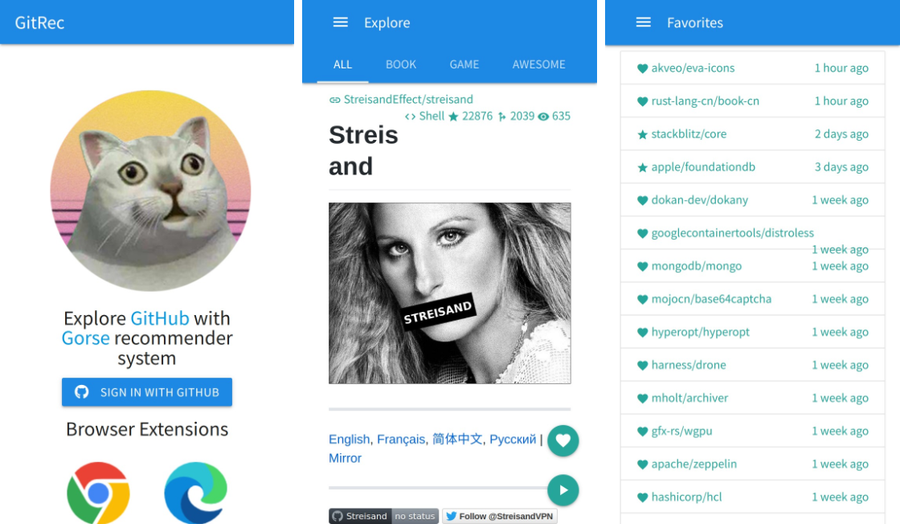
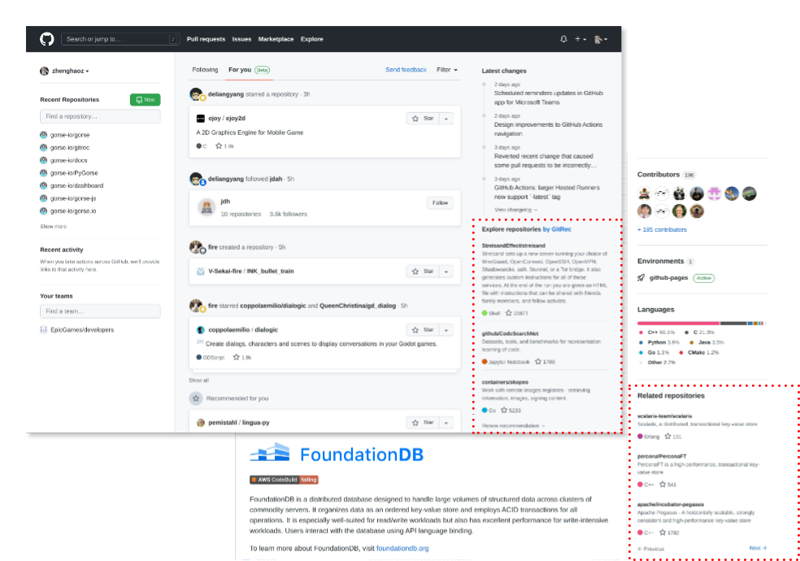

# GitRec


[](https://github.com/zhenghaoz/gitrec/actions/workflows/build_test.yml)
[](https://gitrec.gorse.io)
[](https://discord.gg/x6gAtNNkAE)
[](https://twitter.com/gorse_io)

[GitRec](https://gitrec.gorse.io/) is the missing recommender system for GitHub repositories based on [Gorse](https://github.com/zhenghaoz/gorse).



## Browser Extensions

<table>
  <tbody>
    <tr>
      <td>
        <a href="https://chrome.google.com/webstore/detail/gitrec/eihokbaeiebdenibjophfipedicippfl" target="_blank">
          
        </a>
      </td>
      <td>
        <a href="https://microsoftedge.microsoft.com/addons/detail/gitrec/cpcfbfpnagiffgpmfljmcdokmfjffdpa" target="_blank">
          
        </a>
      </td>
      <td>
        <a href="https://addons.mozilla.org/addon/gitrec/" target="_blank">
          
        </a>
      </td>
      <td>
        <a href="https://greasyfork.org/zh-CN/scripts/453527-gitrec" target="_blank">
          
        </a>
      </td>
    </tr>
  </tbody>
</table>

[](https://chrome.google.com/webstore/detail/gitrec/eihokbaeiebdenibjophfipedicippfl)
[](https://chrome.google.com/webstore/detail/gitrec/eihokbaeiebdenibjophfipedicippfl)
[](https://chrome.google.com/webstore/detail/gitrec/eihokbaeiebdenibjophfipedicippfl)
[](https://addons.mozilla.org/addon/gitrec/)
[](https://addons.mozilla.org/addon/gitrec/)
[](https://addons.mozilla.org/addon/gitrec/)

The browser extension integrates GitHub with GitRec. 
1. Recommends repositories to GitHub users based on starred repositories.
2. Finds related repositories for popular repositories.



## Quick Start

- First, clone the repository and enter the folder.

```bash
git clone https://github.com/zhenghaoz/gitrec.git
cd gitrec
```

- Create a `.env` file.

```bash
# Gorse secrets
GORSE_DASHBOARD_USER_NAME=********
GORSE_DASHBOARD_PASSWORD=********
GORSE_API_KEY=********

# GitHub secrets
GITHUB_ACCESS_TOKEN=********
GITHUB_OAUTH_CLIENT_ID=********
GITHUB_OAUTH_CLIENT_SECRET=********

# GitRec secrets
SECRET_KEY=********

# S3 secrets for backup
S3_ACCESS_KEY=********
S3_SECRET_KEY=********
S3_BUCKET_LOCATION=US
S3_HOST_BASE=s3.amazonaws.com
S3_HOST_BUCKET=%(bucket)s.s3.amazonaws.com
```

- Generate a [personal access token](https://github.com/settings/tokens) from GitHub and fill the `GITHUB_ACCESS_TOKEN`
  variable in the `.env` file.

```bash
GITHUB_ACCESS_TOKEN=xxxxxxxx # personal access token
```

- Create a [GitHub OAuth app](https://github.com/settings/developers). The authorization callback URL should
  be `http://127.0.0.1:5000/login/github/authorized`. Then, fill following variables
  in the `.env` file.

```bash
GITHUB_OAUTH_CLIENT_ID=xxxxxxxx     # client ID
GITHUB_OAUTH_CLIENT_SECRET=xxxxxxxx # client secret
SECRET_KEY=xxxxxxxx                 # random string
```

- Start the cluster using Docker Compose.

```bash
docker-compose up -d
```

- Download the SQL file [github.sql](https://cdn.gorse.io/example/github.sql) and import it to the MySQL instance.

```bash
mysql -h 127.0.0.1 -u gorse -pgorse_pass gorse < github.sql
```

- Restart the master node to apply imported data.

```bash
docker-compose restart
```

- Play with GitRec:

| Entry                     | Link                          |
| ------------------------- | ----------------------------- |
| GitRec                    | http://127.0.0.1:5000/        |
| Grafana Dashboard         | http://127.0.0.1:3000/        |
| Master Dashboard          | http://127.0.0.1:8088/        |

## Acknowledgments

- Thanks [@lisonge](https://github.com/lisonge) for the Tampermonkey userscript.
