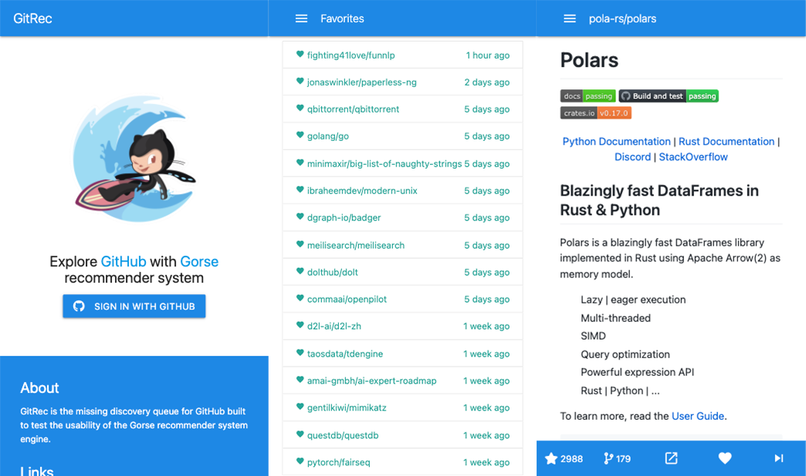
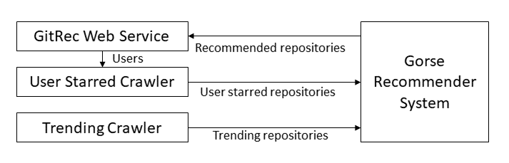

# GitRec


[](https://github.com/zhenghaoz/gitrec/actions/workflows/build_test.yml)
[](https://gitrec.gorse.io)
[](https://discord.gg/x6gAtNNkAE)
<a target="_blank" href="https://qm.qq.com/cgi-bin/qm/qr?k=lOERnxfAM2U2rj4C9Htv9T68SLIXg6uk&jump_from=webapi"></a>
[](https://twitter.com/gorse_io)

GitRec is the missing recommender system for GitHub repositories based on [Gorse](https://github.com/zhenghaoz/gorse).



## Browser Extensions

<table>
  <tbody>
    <tr>
      <td>
        <a href="https://chrome.google.com/webstore/detail/gitrec/eihokbaeiebdenibjophfipedicippfl" target="_blank">
          
        </a>
      </td>
    <td>
      <a href="https://microsoftedge.microsoft.com/addons/detail/gitrec/cpcfbfpnagiffgpmfljmcdokmfjffdpa" target="_blank">
        
      </a>
    </td>
    </tr>
  </tbody>
</table>

## Architecture



- The trending crawler crawls trending repositories and insert them into Gorse as new items.
- The user starred crawler crawls user starred repositories and insert them into Gorse as new feedback.
- GitRec web service pulls recommendations from Gorse and show to users. It also submits a crawling request to the user
  starred crawler when a new user signed in.

## Quick Start

- First, clone the repository and enter the folder.

```bash
git clone https://github.com/zhenghaoz/gitrec.git
cd gitrec
```

- Generate a [personal access token](https://github.com/settings/tokens) from GitHub and fill the `GITHUB_ACCESS_TOKEN`
  variable in [docker-compose.yml](https://github.com/zhenghaoz/gitrec/blob/master/docker-compose.yml).

```yaml
GITHUB_ACCESS_TOKEN: # personal access token
```

- Create a [GitHub OAuth app](https://github.com/settings/developers). The authorization callback URL should
  be `http://127.0.0.1:5000/login/github/authorized`. Then, fill following variables
  in [docker-compose.yml](https://github.com/zhenghaoz/gitrec/blob/master/docker-compose.yml).

```yaml
GITHUB_OAUTH_CLIENT_ID: # client ID
GITHUB_OAUTH_CLIENT_SECRET: # client secret
SECRET_KEY: # random string
```

- Start the cluster using Docker Compose.

```bash
docker-compose up -d
```

- Download the SQL file [github.sql](https://cdn.gorse.io/example/github.sql) and import to the MySQL instance.

```bash
mysql -h 127.0.0.1 -u gorse -pgorse_pass gorse < github.sql
```

- Restart the master node to apply imported data.

```bash
docker-compose restart
```

- Play with GitRec:

| Entry                     | Link                          |
| ------------------------- | ----------------------------- |
| GitRec                    | http://127.0.0.1:5000/        |
| Grafana Dashboard         | http://127.0.0.1:3000/        |
| Master Dashboard          | http://127.0.0.1:8088/        |
| Master Prometheus Metrics | http://127.0.0.1:8088/metrics |
| Server RESTful API        | http://127.0.0.1:8087/apidocs |
| Server Prometheus Metrics | http://127.0.0.1:8087/metrics |
| Worker Prometheus Metrics | http://127.0.0.1:8089/metrics |
